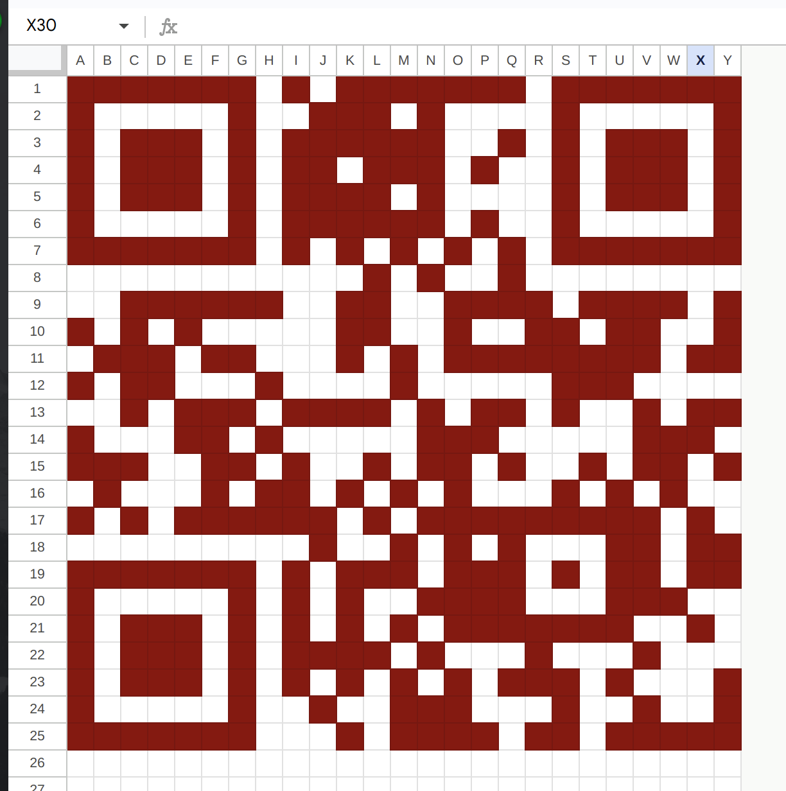

# HV23.01 A letter from Santa

## Description

Finally, after 11 months of resting, Santa can finally send out his presents and challenges again. He was writing a letter to his youngest baby elf, who's just learning his **ABC/A-Z**'s. Can you help the elf read the message?

## Solution

So, getting this flag took me longer that i would like to admit. If you go to the webpage and select the first element from the dropdown and insert an `A` into the input field you get the following pattern.


After a couple of days thinking about the different patterns generated by the dropdown options I decided to start drawin it on paper every pattern representing a line. Soon i realised that it is a QR code. So I started inserting the pattern in google sheets line per line... after a couple of minutes I had the complete QR code, scanned it with my smartphone and finally got the flag.



## Flag

```
HV23{qr_c0des_fun}
```