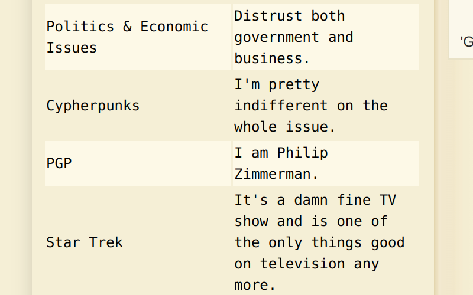

# HV23.02 Who am I?

## Description

Have you ever wished for an efficient dating profile for geeks? Here's a great example:

```
G d--? s+: a+++ C+++$ UL++++$ P--->$ L++++$ !E--- W+++$ N* !o K--? w O+ M-- V PS PE Y PGP++++ t+ 5 X R tv-- b DI- D++ G+++ e+++ h r+++ y+++
```

## Solution

So, well after short googling i found something called [Geek Code](https://en.wikipedia.org/wiki/Geek_Code) which is a way for self-identified geeks to describe their interests, skills, and various aspects of their personalities in a concise and standardized format. It was created by Robert A. Hayden in 1993 as a form of shorthand to communicate a person's geeky attributes in a humorous and coded manner. The Geek Code consists of a series of letters and symbols, each representing a different category.

With this information i searched for an online tool which enables me to decode the provided geek code. The one i used was [this](https://www.dcode.fr/geek-code). On the left it display the various properties and after a short eye scan i found the PGP property which tells us the name of the described person: I am Philip Zimmerman. So the flag is obviously: `HV23{Philip Zimmerman}`



## Flag

```
HV23{Philip Zimmerman}
```