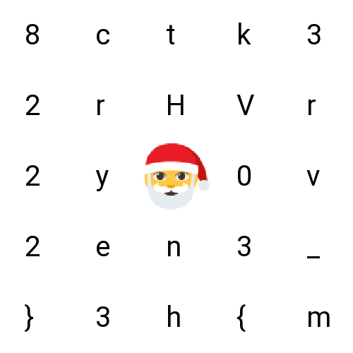
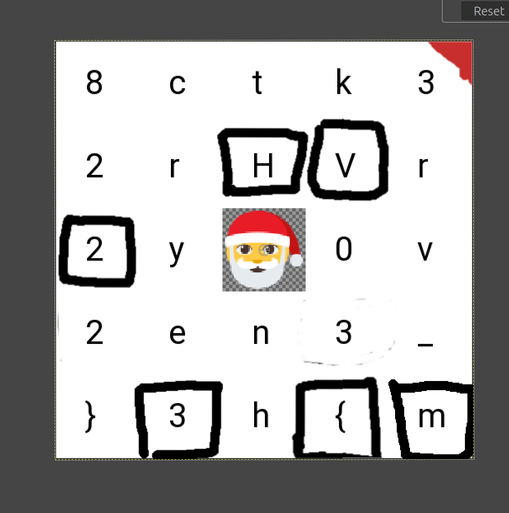
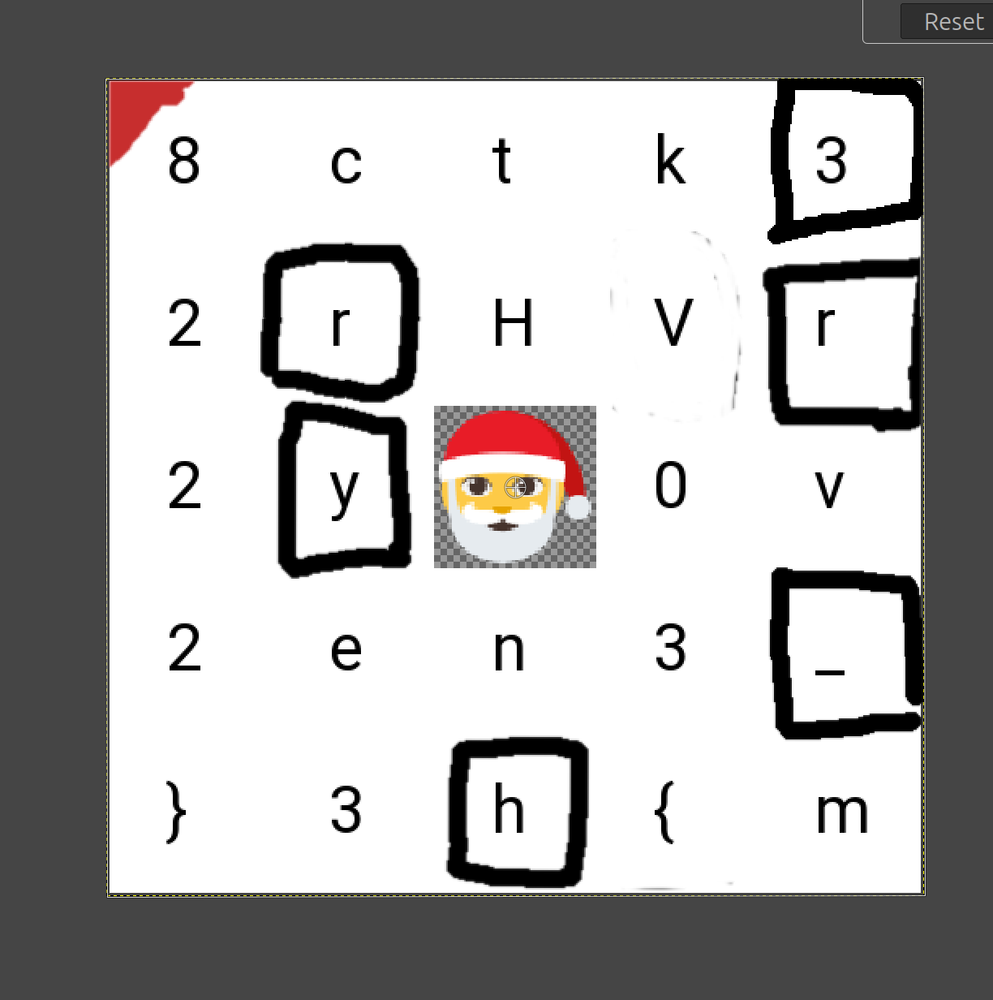
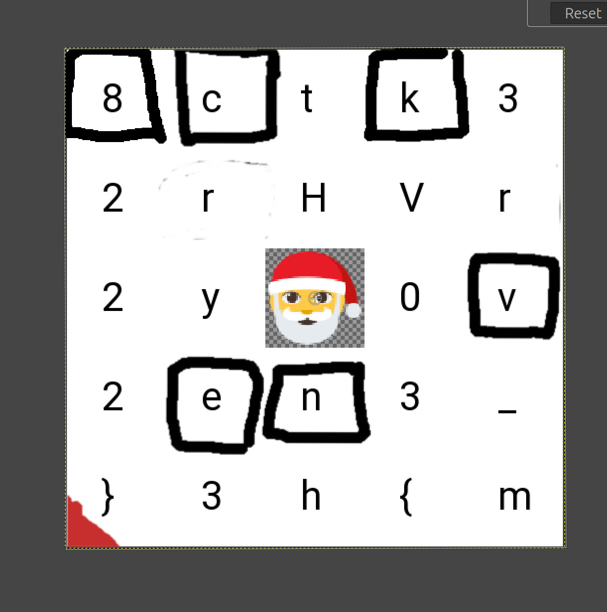
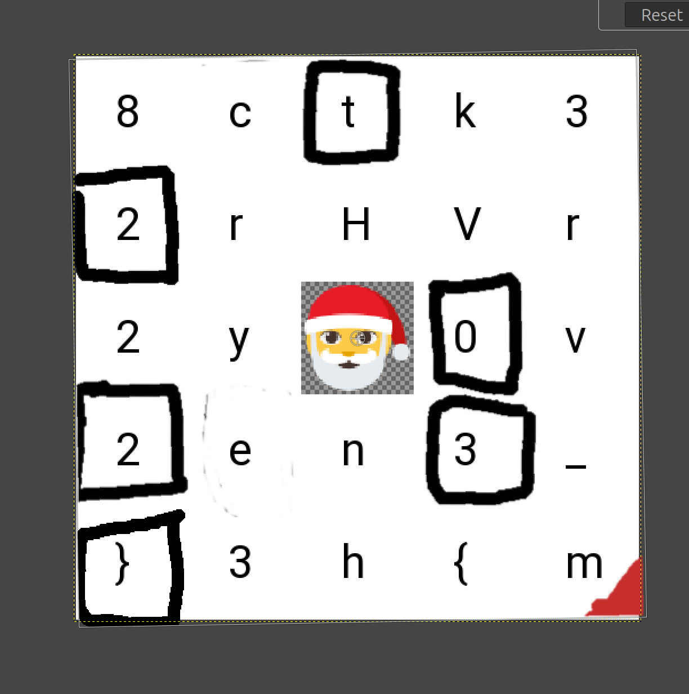

# HV23.03 Santa's grille

## Description

While contemplating the grille and turning some burgers, Santa decided to send all the hackers worldwide some season's greetings.



## Solution

After googling what a grille cipher is which i found by doing a google image reverse search of the provided image in the description of the challenge. I read the [wikipedia article](https://en.wikipedia.org/wiki/Grille_(cryptography)). And started with trial and error in gimp because i knew the beginning must be `HV23{` but what i didn't realise, was that it can also be rotated counter clockwise. Shortly after i realised that the letter `m` must also be circled and so it was pretty easy to solve. 






## Flag

```
HV23{m3rry_h8ckvent2023}
```