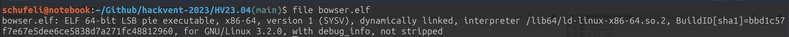
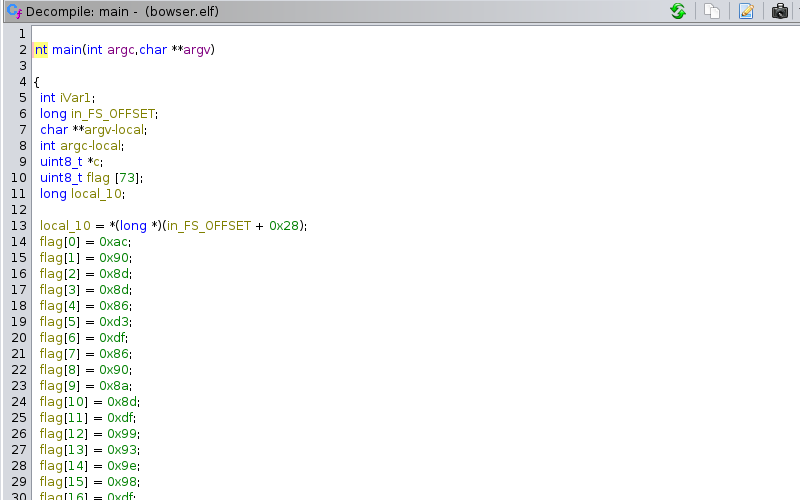
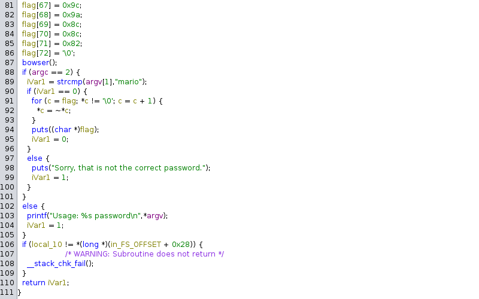
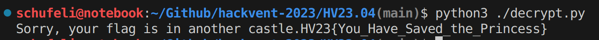

# HV23.04 Bowser

## Description

Santa has heard that some kids appreciate a video game as a christmas gift. He would rather have the kids solve some CTF challenges, so he took some inspiration and turned it into a challenge. Can you save the princess?

## Solution

As always when playing CTF the more we know and informations we have on hand the faster we can solve the challenge without going down the completely wrong path. So when running the `File` command on the bowser.elf file. We can see that it in deed is a ELF-64-bit executable and not just a distraction.



### Loading the file into Ghidra

For further research and decompilation I decided to load the file into Ghidra to get the decompiled output of the functions. After some short clicking around i found the main function which has a an array with 73 elements inside. 

If you have a look at `line:91` we can see that it is a simple bitwise operation done to get the characters out of the flag. So we need to find a way to reverse this to get the flag out.




### What is the encryption?

> A simple bitwise NOT operation encryption, often referred to as bitwise complement or bitwise negation, involves applying the bitwise NOT (~) operator to each bit of the data being encrypted. In the context of characters or bytes, this operation inverts the bits, changing each 0 to 1 and each 1 to 0.

### Writing a short python script

As we now know that the flag can be retrieved by applying bitwise negation to the array. We can write a short python script which will get us the flag in the end.

```python
def decrypt_flag(encrypted_flag):
    decrypted_flag = []
    
    for char in encrypted_flag:
        decrypted_char = ~ord(char) & 0xFF
        decrypted_flag.append(chr(decrypted_char))

    return ''.join(decrypted_flag)

flag = [
    0xac, 0x90, 0x8d, 0x8d, 0x86, 0xd3, 0xdf, 0x86,
    0x90, 0x8a, 0x8d, 0xdf, 0x99, 0x93, 0x9e, 0x98,
    0xdf, 0x96, 0x8c, 0xdf, 0x96, 0x91, 0xdf, 0x9e,
    0x91, 0x90, 0x8b, 0x97, 0x9a, 0x8d, 0xdf, 0x9c,
    0x9e, 0x8c, 0x8b, 0x93, 0x9a, 0xd1, 0xff, 0xb7,
    0xa9, 0xcd, 0xcc, 0x84, 0xa6, 0x90, 0x8a, 0xa0,
    0xb7, 0x9e, 0x89, 0x9a, 0xa0, 0xac, 0x9e, 0x89,
    0x9a, 0x9b, 0xa0, 0x8b, 0x97, 0x9a, 0xa0, 0xaf,
    0x8d, 0x96, 0x91, 0x9c, 0x9a, 0x8c, 0x8c, 0x82
]

print(decrypt_flag(''.join([chr(value) for value in flag])))
```

The decrypt_flag function takes an encrypted flag as input, which is assumed to be a string. It iterates through each character in the input string, applying a series of bitwise operations to invert its bits. The result is then converted back to a character. This process is repeated for each character in the input, and the decrypted characters are stored in a list.

The flag array contains the hexadecimal values of the encrypted flag, which were obtained by applying the bitwise NOT operation to the original flag. The Python code then calls the decrypt_flag function with the characters obtained from converting the hexadecimal values in the flag array back to characters. The decrypted characters are joined together to form the final decrypted flag.

In the output below, you will see the decrypted flag printed to the console.



## Flag

```
HV23{You_Have_Saved_the_Princess}
```

