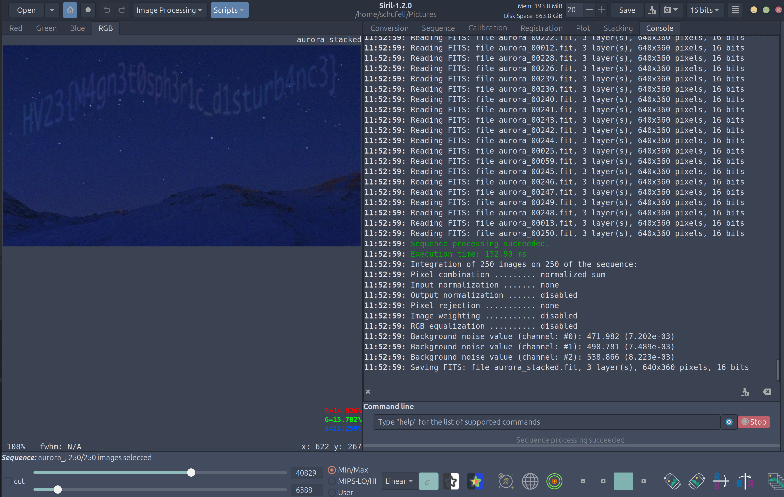

# HV23.05 Aurora

## Description

The Northern Lights appeared at exceptionally low latitudes this year due to the high level of solar activity. But from Santa's grotto at the North Pole, it's not unusual at all to see them stretching across the sky. Snowball the elf tried to capture a video of the aurora for his Instagram feed, but his phone doesn't work well in poor light, and the results were rather grainy and disappointing. Is there anything you can do to obtain a clearer image?

## Solution

Well well well this for me personaly was one kind of a journey. First of all I searched google about enhancing videos of night skyies. Soon i found ways and tools to improve the quality of astro photography and decided to extract all frames as png from the mp4 video. Luckily there are a milion tools availabe online to do that. One tool i found to use to stack those frames is called [Siril](https://siril.org/) and thank good it was available for linux. So i installed it and loaded all the frames into it and executed the stacking button. This worked and i got the following image providing me with the flag.

## Flag

HV23{M4gn3t0sph3r1c_d1sturb4nc3}