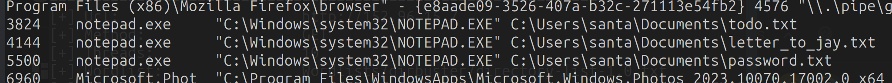
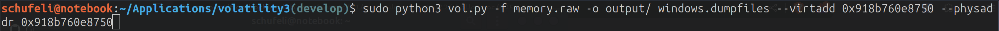

# HV23.06 Santa should use a password manager

## Description

Santa is getting old and has troubles remembering his password. He said password Managers are too complicated for him and he found a better way. So he screenshotted his password and decided to store it somewhere handy, where he can always find it and where its easy to access.

Santa recommends the volatility profile `Win10x64_18362`

## Solution

Firstly, as I experienced in previous CTFs i tried running the following command:

```bash
python3 vol.py -f memory.raw windows.cmdline
```

Which gave me the following output, which i tried to investigate further but soon realised was probably placed there by the author. So the idea of dumping the content opened in the notepad.exe was the wrong approach



The next thing to try was to get a list of the file system and write that to a file to make it easily searchable. Then i searched for image files as it clearly said that `he screenshotted his password and decided to store it somewhere handy`

```
0x918b760f8150	\Users\santa\AppData\Roaming\Microsoft\Windows\Themes\CachedFiles\CachedImage_1024_785_POS4.jpg	216
0x918b76c468f0	\Users\santa\AppData\Roaming\Microsoft\Windows\Themes\CachedFiles\CachedImage_1680_1050_POS4.jpg	216
0x918b76c64a30	\Users\santa\Pictures\cool-santa-claus.jpg	216
0x918b7711c7c0	\Users\santa\Pictures\cool-santa-claus.jpg	216
0x918b77131490	\Users\santa\AppData\Roaming\Microsoft\Windows\Themes\CachedFiles\CachedImage_1680_1050_POS4.jpg
0x918b7602a230	\Program Files\WindowsApps\Microsoft.Windows.Photos_2023.10070.17002.0_x64__8wekyb3d8bbwe\Assets\Blank_PhotosSplashWideTile.png	216
0x918b760e8750	\Users\santa\Pictures\wallpaper.png	216
0x918b760e88e0	\Users\santa\AppData\Local\Packages\Microsoft.Windows.Photos_8wekyb3d8bbwe\LocalState\PhotosAppBackground\wallpaper.png	216
0x918b760ed250	\Users\santa\Pictures\wallpaper.png	216
0x918b760ed3e0	\Users\santa\AppData\Local\Packages\Microsoft.Windows.Photos_8wekyb3d8bbwe\LocalState\PhotosAppBackground\wallpaper.png	216
0x918b76974b60	\Program Files\WindowsApps\Microsoft.MicrosoftStickyNotes_6.0.1.0_x64__8wekyb3d8bbwe\Assets\Devices-light.png	216
0x918b76c517f0	\Users\santa\Pictures\wallpaper.png	216
0x918b76c54860	\Users\santa\AppData\Local\Packages\Microsoft.Windows.Photos_8wekyb3d8bbwe\LocalState\PhotosAppLockscreen\wallpaper.png	216
0x918b76c56160	\Users\santa\AppData\Local\Packages\Microsoft.Windows.Photos_8wekyb3d8bbwe\LocalState\PhotosAppLockscreen\wallpaper.png	216
0x918b771069c0	\Users\santa\Pictures\wallpaper.png	216
0x918b771082c0	\Program Files\WindowsApps\Microsoft.MicrosoftStickyNotes_6.0.1.0_x64__8wekyb3d8bbwe\Assets\NewNotePlaceholder-light.png	216
0x918b7710a840	\Program Files\WindowsApps\Microsoft.MicrosoftStickyNotes_6.0.1.0_x64__8wekyb3d8bbwe\Assets\SearchPlaceholder-light.png	216
0x918b7710d270	\Program Files\WindowsApps\Microsoft.MicrosoftStickyNotes_6.0.1.0_x64__8wekyb3d8bbwe\Assets\SignInUpsellCloud.png	216
```

What was really intersting to me were the following two files so I dumped them and had a look. 



After dumping all files i realised that the flag is inside the wallpaper of santas desktop. If you open it you'll find a QR code in the top right corner which when scanned reveals the flag.


## Flag

```
HV23{FANCY-W4LLP4p3r}
```