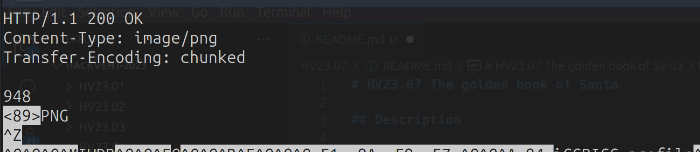
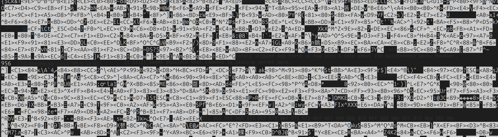
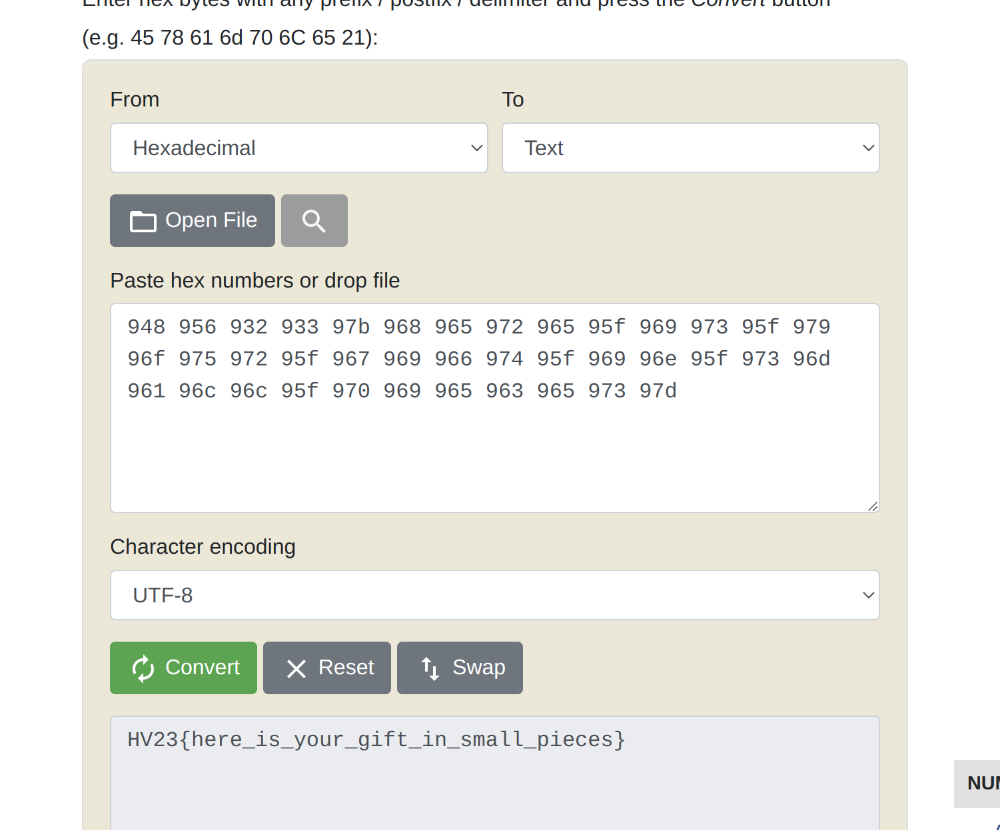

# HV23.07 The golden book of Santa

## Description

An employee found out that someone is selling secret information from Santa's golden book. For security reasons, the service for accessing the book was immediately stopped and there is now only a note about the maintenance work. However, it still seems possible that someone is leaking secret data.

Hint #1: `It is recommended to initiate a direct connection to the server without any proxy in between`

## Solution

The initial step involved a simple call to the webpage to assess the situation. A peculiar image caught my attention:


Curiosity led me to inspect the image for any hidden data. I opened it with various editors and spent a considerable amount of time searching. After a few frustrating hours, the recollection of the first hint prompted me to download the file using netcat:

```bash
netcat f02e5ea7-2b76-4839-82f0-30f8bdd11277.rdocker.vuln.land 80 > test.txt
```

Examining this file revealed more information than the image downloaded through the browser, as it displayed HTTP Response Headers in the first few lines:



Particularly intriguing was the number 948, prompting further investigation. Scrolling down, I noticed that the transmitted data was split into chunks, each marked by a hex value:



The task of retrieving these hex numbers and recording them began:

```
948 956 932 933 97b 968 965 972 965 95f 969 973 95f 979 96f 975 972 95f 967 969 966 974 95f 969 96e 95f 973 96d 961 96c 96c 95f 970 969 965 963 965 973 97d
```

After a few minutes, the flag was uncovered by inputting these hex numbers into an online hex-to-UTF-8 converter:



## Flag

```
HV23{here_is_your_gift_in_small_pieces}
```


